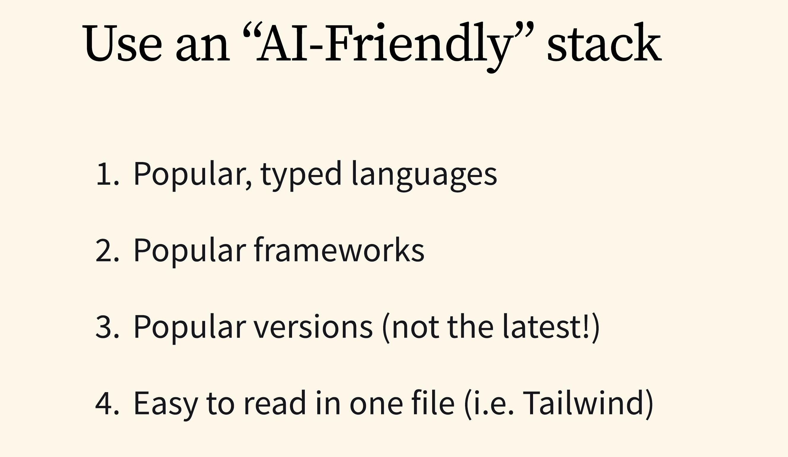
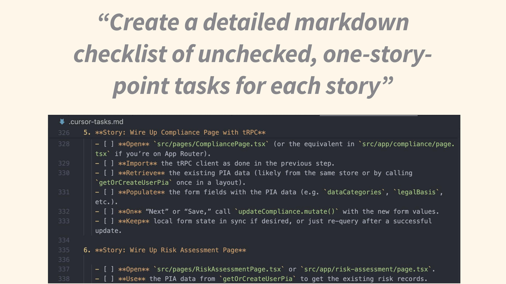
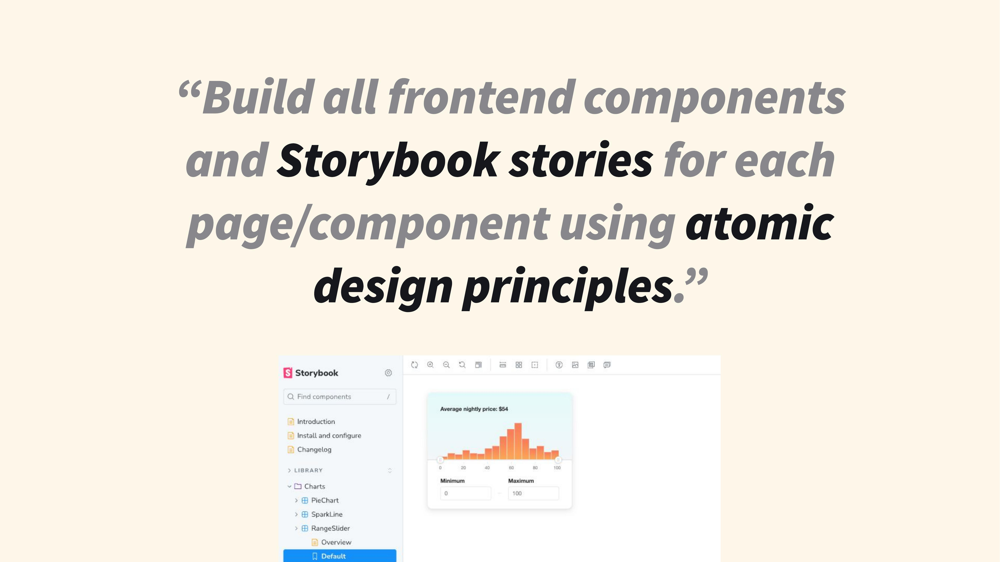
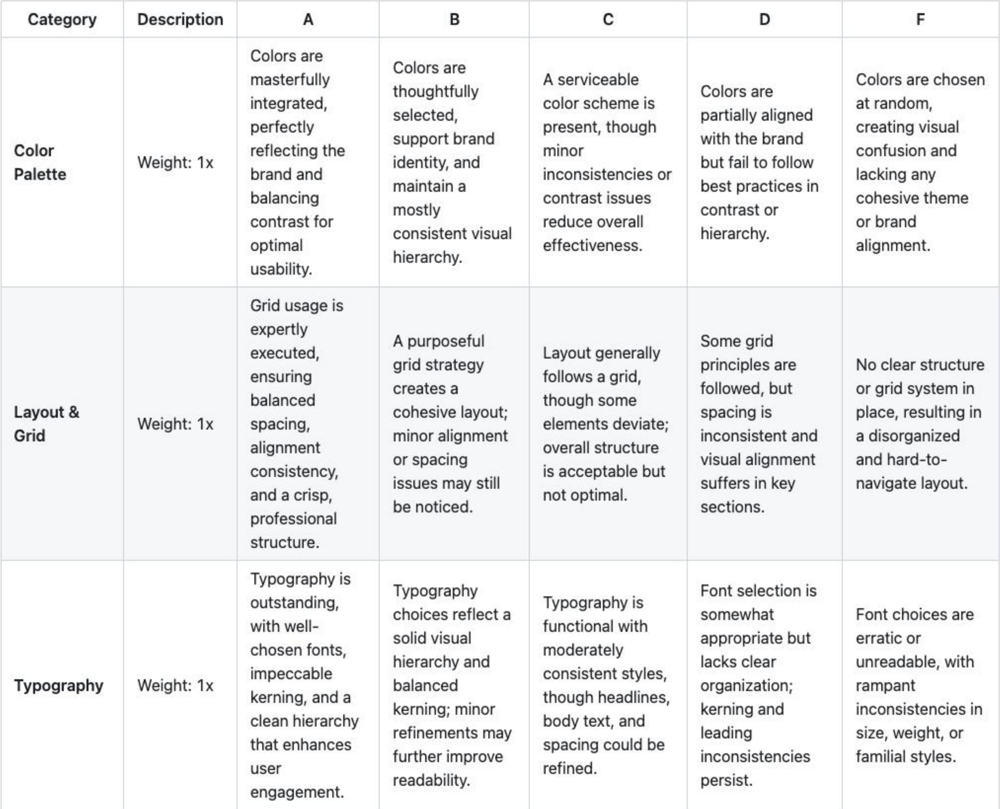

<!-- Insert image: Kevin presenting at conference -->

So I kind of accidentally became a YouTuber the other day.

I've been doing AI coding for a long time. About a year and a half ago, I started working on my own AI coding open-source project and have been naturally curious about this space. Recently, I've been building things really quickly with AI assistance.

One day I shared my workflow with a colleague, and he was like, "Oh, this is cool." I was like, "This is what we do every day." It didn't feel weird to me.

Then I posted it on some Reddit forum, and everybody went wild: "Oh my gosh, what are you doing? This is mad! This is crazy!" That's when I realized people find this interesting.

Let me condense hours of (potentially boring) videos into the most important things you need to know when vibe coding with AI.

## Tip #1: Use an AI-Friendly Stack

There's a very jagged edge in terms of how fast and how well you can code with AI. I tend to be more towards the bleeding edge, given my job and everything I've been doing.

What I consider AI-friendly:

- Use typed languages (TypeScript is really good)
- Stick with popular frameworks and versions
- Stay away from very new releases (e.g., I didn't upgrade to Tailwind 4.0 right away because the LLM has no idea how to use it yet)
- Use verbose languages (Python works great)
- Use Tailwind so you're not going back and forth between styles and components

If you're interested, I've put together a [Next AI Starter](https://github.com/kleneway/next-ai-starter) - it's very opinionated and batteries-included.

## Tip #2: Start Outside Your IDE with the Smartest Model

I always begin outside my code editor, using the smartest AI model available to generate detailed specs and documentation. My workflow typically involves:

1. Using speech-to-text to chat with the AI
2. Iterating until I get a solid outline
3. Leveraging context to help the model fill in as many gaps as possible
4. Building a clear checklist before I start coding

Whether it's a new app or feature, the goal is to get a comprehensive plan. I even record meetings with business leads and feed those transcripts to the AI.

Here's a real-world example. I've been building an AI coding agent similar to Google's, and this is how I approached it:

<!-- Insert screenshot: BRD and requirements generation process -->

I use a series of prompts to have the model think through BRD best practices and other PM-style documentation. I don't read all this initial output - the whole point is to keep going until I get a practical checklist of tasks.

A key magic phrase I use is "one story point stories" - it hits that sweet spot of about 25 back-and-forth messages. If you do one at a time, you're constantly copying, pasting, and doing busywork. If you do too much, it goes off the rails.

Once I have my checklist in markdown, I copy it into my project's cursor tasks file, which gives me a structured plan of everything I need to do.

## Tip #3: Use Storybook for Front-End First

<!-- Insert screenshot: Storybook component hierarchy -->

Lately, I've been starting with Storybook - a front-end tool that serves as visual testing for components. For new projects, I tell the AI to:

1. Create the front-end first
2. Make Storybook stories for each component
3. Follow atomic design structure (components → sections → pages)

This approach has several benefits:

- Prevents code duplication (cursor sometimes copies similar code across files)
- Self-documents the code
- Makes iteration much easier (you can move UI elements around without database migrations)
- Gets you Storybook setup for free (which is normally a hassle)

## Tip #4: Use Rubrics with Thinking Models

<!-- Insert screenshot: Example rubric with A-F grading categories -->

Here's an Easter egg I hid in one of my videos. About six weeks ago at PSL, we discovered that using rubrics with thinking models produces significantly better results.

While thinking models are great with coding, math, and logic, they can be mediocre for design questions and other subjective areas. Our solution? Take a rubric we'd been using at PSL for evaluating company ideas, feed it to the LLM, and see what happens. The ideas we got back were dramatically higher quality.

How it works:

1. Think of a category (UX design, feature ideation, etc.)
2. Ask the AI to "create a rubric with 5-7 categories, with A through F descriptions"
3. Tell the model to keep thinking until it has an "A" across every category

This forces the model to think deeply before producing output. I keep several rubrics in my docs folder and reference them when needed.

## Tip #5: Don't Go Too Fast

As your project grows and you're no longer starting from scratch, you'll need to reference a lot of existing code. Tools like [RepoMix](https://repomix.com/) can help (I vibe-coded an open-source version that works on Windows and doesn't cost $200).

I switch between the smartest available models. For instance, Claude 3.5 Pro isn't available in the API, so I use Deep Research with the "no research" flag to get a super smart model.

## Tip #6: Design and Debugging Shortcuts

For design improvements, I've found that a simple "Hey, this sucks. Make it pop. Make it look better." actually works surprisingly well. You might need to try 3-4 times and maybe mention that rubric, but it's pretty decent at improving designs.

For debugging, don't immediately ask for code. Instead, ask for "5-7 different ideas of why this may not be working, and pick the best." This forces the model to think in different contexts before giving you better answers.

## Keeping Projects Maintainable Long-Term

One challenge with AI-generated code is maintainability. When you build a complex app really fast, it can become difficult to modify later because the AI might make design decisions you wouldn't have made.

My approach:

1. Work for about a week, then ask the AI to "find any issues with this codebase"
2. Spend 2-3 hours refactoring based on its suggestions
3. Use a stack I'm familiar with
4. Create very specific cursor rules (I spent hours making these exactly how I like to write code)
5. Schedule regular refactoring sessions (about once a week)

## The Future of Development Teams

<!-- Insert image: Developer teams evolution diagram if available -->

Moving forward, I believe teams will lean toward engineers who are enthusiastic about AI and are embracing it (rather than pushing back). Ask potential hires what they've done recently with AI that they found interesting.

We'll also see more generalists with good taste in design who can think through product specs and write code. Smaller teams of these versatile developers will likely become the norm, rather than larger teams of specialists.

The biggest differentiator right now is enthusiasm - people in this room versus those who dismiss it as hype. If you're on the bleeding edge, you can move incredibly quickly, and it's a good time to start learning because it's only going to get better.

---

_For more tips, check out my [YouTube channel](https://www.youtube.com/@kevinleneway2290) or my open-source project [Jacob](https://github.com/jacob-ai-bot/jacob)._
