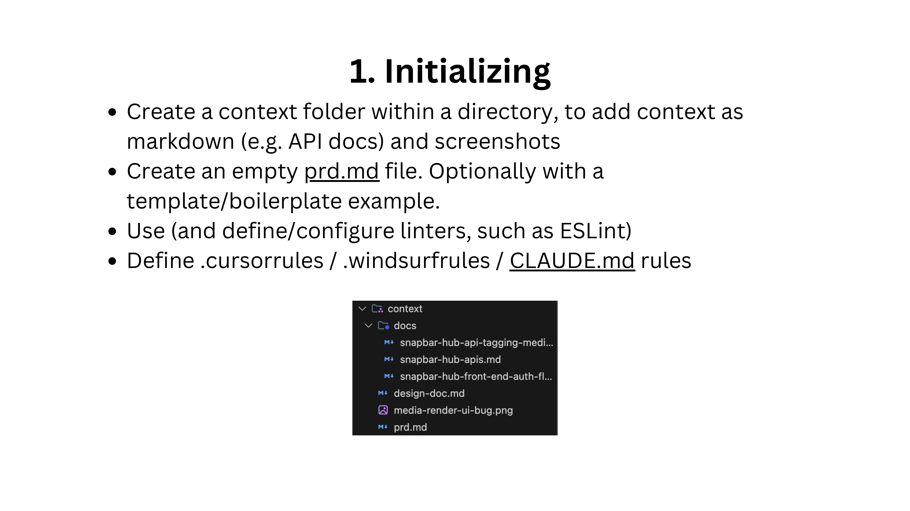

<!-- IMAGE: Insert header image showing "AI Engineering + Vibe Coding Tips" slide -->

As an early-stage startup CTO with 10+ years of full-stack engineering experience, I've spent the past two years diving deep into the world of GenAI and CodeGen. The speed at which this space is moving is mind-blowing — just look at how "vibe coding" and "prompt engineering" are trending at comparable levels on Google Trends!

<!-- IMAGE: Insert Google Trends image showing prompt engineering vs vibe coding -->

I want to share where AI engineering and "vibe coding" have truly helped our 8-person team (13-ish including contractors) at Snapbar, where we've had GenAI-based products in production for about two years.

## What is "Vibe Coding" and Where It Shines

For us, vibe coding involves using tools like Bolt.new or Lovable.dev for prototyping, and then transitioning to Cursor, Windsurf, or Cloud Code for more production-ready development. This approach has been transformative in several key areas:

### 1. Empowering Non-Technical Team Members

One of the most valuable aspects has been enabling our non-technical folks—product, sales, even our CEO—to prototype and explore ideas independently. This creates a new communication channel between non-engineering and engineering teams:

- **Requirements & capabilities communication**: Non-technical team members can iterate with an AI "engineer" to define capabilities more concretely
- **Replacing Figma for some use cases**: For many of our apps, especially early-stage ones, this workflow has replaced traditional mockup tools
- **Customer development acceleration**: We can quickly spin up demos for sales and get partner feedback
- **Development speed**: For simple components like slideshows, we've gone from Bolt prototypes directly to production with minimal engineering oversight

A great real-world example: we shipped a slideshow that went from Bolt to Cursor and entered production in just a week, with appropriate code reviews but minimal engineering intervention.

### 2. Augmenting Traditional Development

Beyond the "pure" vibe coding approach, we're finding huge value in using AI models as "para-programmers" or thinking partners in more disciplined engineering workflows.

Think about the rubber duck debugging concept, where explaining a problem to an inanimate object helps you solve it. Now we have intelligent systems that can provide actual feedback and insights while you talk through challenges.

Following the approach outlined in Claude Code's documentation, we maintain traditional software engineering discipline while boosting productivity dramatically. This isn't vibe coding—it's traditional engineering with AI acceleration.

Interestingly, my personal development workflow changes almost completely every two months as tools and techniques evolve.

### 3. Transforming Solutions Engineering & Enterprise Customization

This application might be the most underrated business impact. We've developed what's essentially a new hybrid SaaS-to-Service model—a "productized service" approach that lets us capture more customer value.

For context, Snapbar is an event marketing platform with AI tools for marketers. Enterprise clients often need customized microsites for product launches or events. By pushing slightly more into the service side with a productized approach, we deliver much more customer value while heavily automating the customization process with CodeGen tools.

Our solutions engineers and operations teams use Cursor and Windsurf to handle the "last mile" of customization, dramatically increasing our speed and capabilities.

### 4. Strategy & Research Acceleration

AI has been invaluable for deep research and strategic thinking. We use:

- OpenAI's Deep Research (which uses O3 under the hood) for market research, company strategy, product strategy, and exploring new releases
- Claude for analyzing transcriptions from meetings and customer calls
- NotebookLM's podcast feature for interacting with meeting content

After extracting insights, we can feed summaries into Claude to create structured documentation like PRDs.

## My Favorite Tools & Resources

Here's my current tech stack that's consistently delivering results:

### AI Models

- **Claude 3.7 / 3.7 Thinking** for most code generation and architecture
- **OpenAI's o1 pro and o3-mini-high** for architectural thinking and "rubber ducky" problem-solving
- **OpenAI's Deep Research** for understanding new technologies and strategic research

### CodeGen Tools

- **Cursor / Windsurf / Claude Code** for core development
- **Bolt.new / Lovable.dev** for prototyping and greenfield development

### Model Context Protocol (MCP) Tools

- [MCP directory of servers/clients](https://github.com/modelcontextprotocol/servers)
- [Browser Tools](https://github.com/AgentDeskAI/browser-tools-mcp) for giving Claude/Cursor context from your browser
- [Firecrawl](https://github.com/mendableai/firecrawl-mcp-server) for turning websites into markdown context

### Other Essential Tools

- **Superwhisper** for speech-to-text with context awareness
- **Google Docs' Markdown export** for feeding documentation into the AI workflow

## Practical Strategies That Actually Work

After months of experimentation, here are the approaches that have consistently delivered results:

### Context is Everything

Have empathy for the LLM's limitations. If you only knew what the model knows, could you complete the task? Think about:

- What's in the model's context and what's indexed in your codebase
- What the model was trained on and what additional information it needs
- Providing specific examples, detailed requirements, and relevant documentation

The quality of your context directly determines the quality of the output. This means including API docs, style guides, linter configurations, and even screenshots as needed.

### Define Your Tech Stack Up Front

Choose languages, frameworks, and libraries that are LLM-friendly (TypeScript, React, Next.js, Node). These have abundant training data from high-quality open-source projects, leading to better code generation.

### Ephemeral vs. Durable Code

Understand which parts of your codebase can be treated as "disposable" versus what needs long-term maintenance. Sometimes it makes more sense to rebuild components from scratch rather than maintain complex generated code.

### Iterative Prototyping

Vibe coding enables a "lead bullets" rather than "silver bullets" approach. We explore multiple ideas and validate technical feasibility via CodeGen before committing engineering resources.

For best results:

1. Try several iterations to get a working solution
2. Stash your work, refine the prompt/context, and retry
3. Use LLMs to create detailed descriptions of prototyped apps, then use these descriptions to rebuild more robust versions

### Beyond Coding

These models excel at UI design, SEO optimization, copy writing, project scoping, security checks, and architectural planning. By starting with high-quality design principles from training data, we iterate from a much higher baseline and focus on unique aspects rather than reinventing the wheel.

## My Core Workflow

Here's my practical development workflow using these tools:

1. **Initialize the project environment**:

   - Create a `context` folder to store markdown docs, API references, and screenshots
   - Create a `prd.md` file with requirements template
   - Define linters and configure `.cursorrules` or `.windsurfrules`

2. **Collaborative development**:

   - Treat Cursor/Claude as a thinking partner rather than just a code generator
   - Start by asking it to think through requirements before writing code:

   ```
   Let's create a PRD document given the problem statement
   and requirements we discussed. Please write a markdown
   file following the @context/prd.md template.
   ```

   - Provide additional context when the AI struggles
   - Use GitHub CLI utilities to automate PR creation

<!-- IMAGE: Insert the folder structure screenshot from slide 16 -->



## Educational Resources

The space is evolving so quickly that staying current is critical. Here are my go-to resources:

### Podcasts:

- [Latent Space](https://www.latent.space/podcast)
- [The AI Daily Brief](https://podcasts.apple.com/us/podcast/the-ai-daily-brief-formerly-the-ai-breakdown/id1680633614)

### YouTube Channels:

- [AI Explained](https://www.youtube.com/@aiexplained-official)
- [AI Engineer](https://www.youtube.com/@aiDotEngineer)
- [Andrej Karpathy](https://www.youtube.com/@AndrejKarpathy)
- [AI Jason](https://www.youtube.com/@AIJasonZ)

### Websites/Blogs:

- [https://www.latent.space/](https://www.latent.space/)
- [https://course.fast.ai/](https://course.fast.ai/)
- [https://www.deeplearning.ai/courses/](https://www.deeplearning.ai/courses/)
- [https://karpathy.ai/zero-to-hero.html](https://karpathy.ai/zero-to-hero.html)

### Events:

- [AI Tinkerers](https://seattle.aitinkerers.org/)
- [AI Engineer Summit (NYC)](https://www.ai.engineer/summit/2025)
- [AI Engineer Worlds Fair (SF)](https://ti.to/software-3/ai-engineer-worlds-fair-2025)
- [Madrona IA40 Summit](https://www.ia40.com/summit)

## Final Thoughts

Understanding the second and third-order effects of these technologies is fascinating. For example, the "productized service" model enabled by CodeGen tools is creating new business opportunities we hadn't anticipated.

The quality and capabilities available are changing incredibly fast - what worked two months ago might be completely different today. Keep experimenting, stay connected to educational resources, and remember that having empathy for how LLMs work will consistently deliver the best results.

_Patrick Ellis is the CTO and Co-Founder of Snapbar, an event marketing platform with AI tools for marketers._
