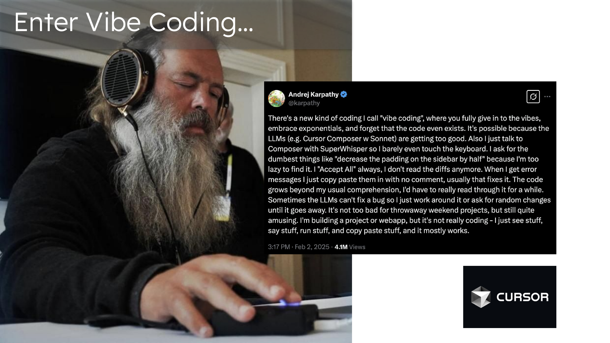
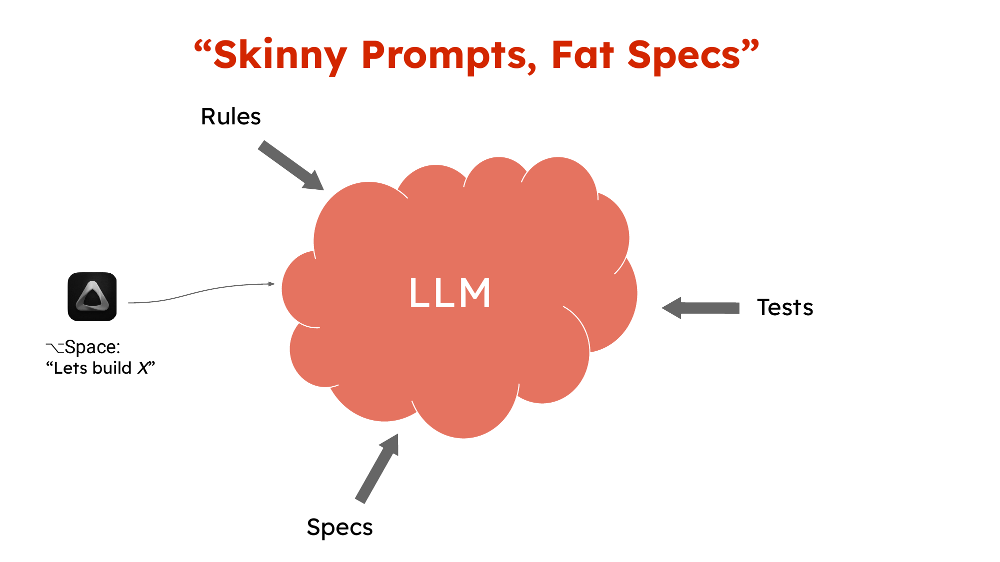
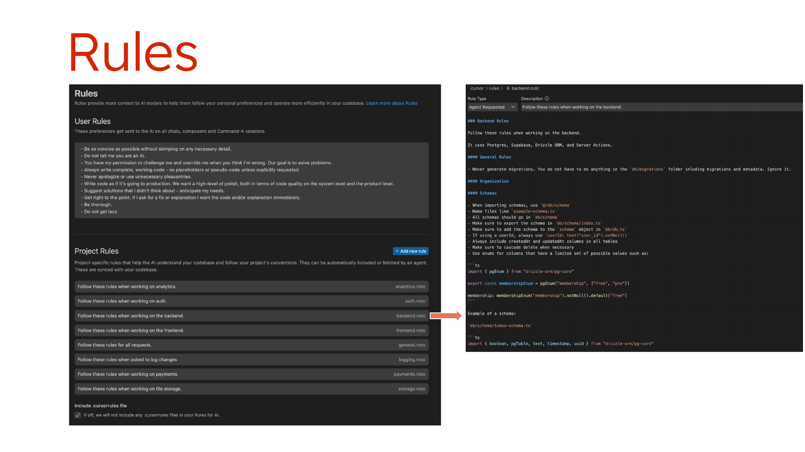
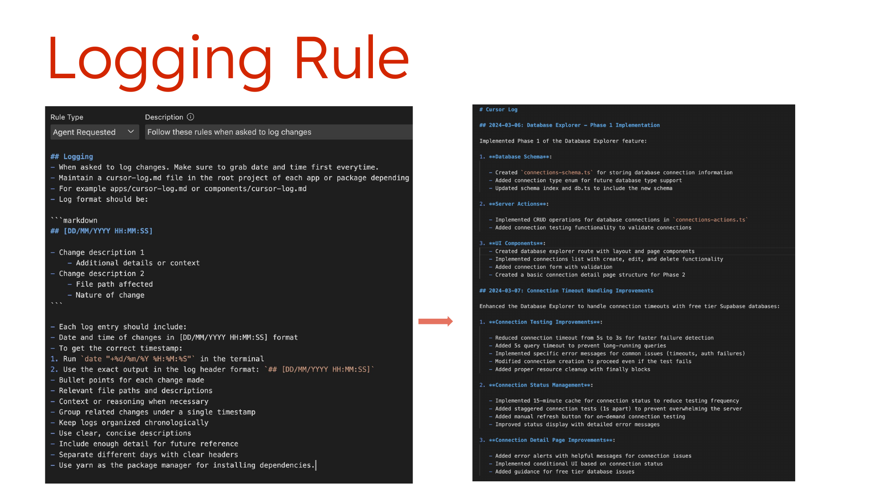
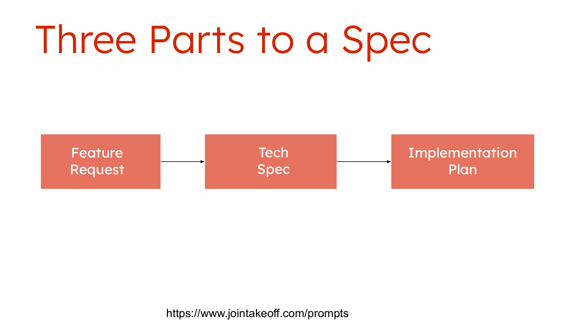
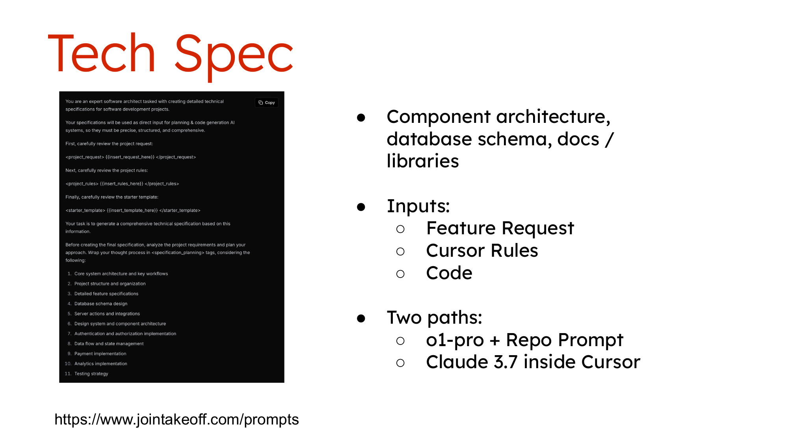
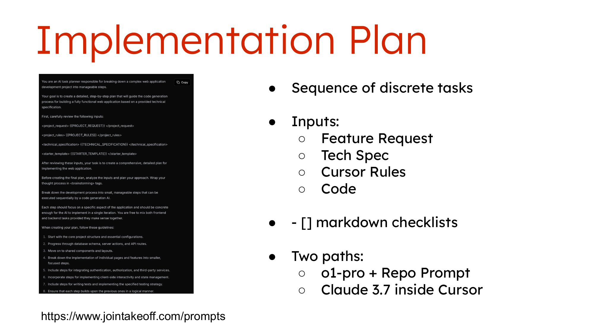
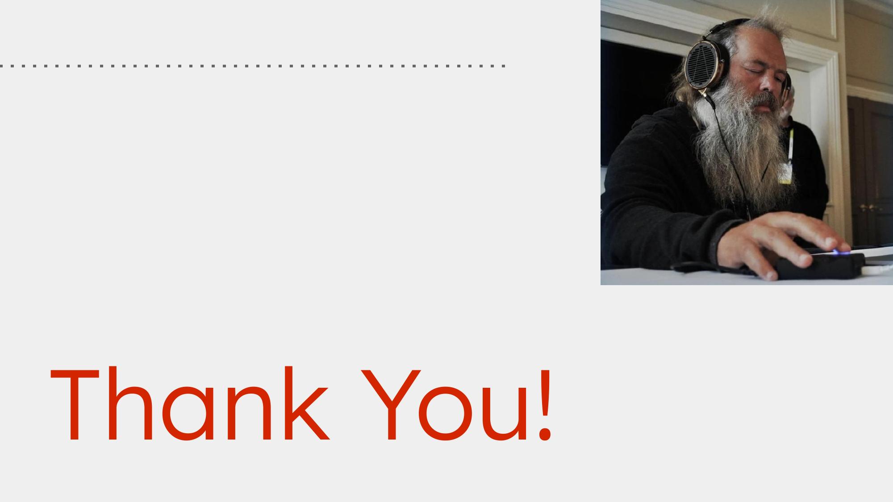

## My Background and Context

I wouldn't consider myself an engineer. I haven't been full-time coding in a decade plus. When I was doing a lot of coding, it was in this era where Ruby on Rails was all the rage, you had U-Scooter Shrap for career CSS, and jQuery was the JavaScript framework of choice—way before React. I was using Chrome for deployment.

So, the things I'm doing now with Cursor, I would definitely consider vibe coding, because I don't know a lot of the stuff that I'm actually doing full-time. At the same time, I'm not a complete beginner—I know how to set up my local environment, use source versioning, handle deployment, and all these sort of fundamental things.

That's important context because there's a lot of things around development beyond just the code itself where being productive matters. I like to think I'm kind of in the sweet spot because I have to play the game a little bit, and I know enough to get going.

## What is Vibe Coding?

"Vibe coding" as a term is only about five weeks old (as of this workshop in March 2025), kicked off by a tweet on February 2nd. Wild to think about! A lot has happened in that time—Claude released 3.7, Cursor leaned much more into its agent mode, and the whole space is rapidly developing.

If you're looking for resources to learn from, there's a lot on Twitter. I follow Mckay Wrigley ([@mckaywrigley](https://twitter.com/mckaywrigley)) for many of his tutorials—I've subscribed to his courses and found them helpful for learning the basics of Cursor as well as different prompting workflows.

## My Tech Setup

For personal projects, I usually use this [starter template](https://github.com/mckaywrigley/mckays-app-template). I find it helpful to use a starter template not only because it's full stack and makes it quick to go if you're not very opinionated on exactly what tools you want to use, but this comes with Cursor rules built for this specific stack. It's ready to go, so you can be productive very quickly.

## The Mental Model: "Skinny Prompts, Fat Specs"

<!-- IMAGE: Consider adding the slide showing "Skinny Prompts, Fat Specs" concept -->

When vibe coding is working the way we picture it in the memes, you're just firing off your voice transcriber saying a simple sentence, and then the code just grows and it's there, and then it's all working.

When I first started using Cursor, that's basically how I started. I would just use different prompts in the composer, and that was my workflow. It worked reasonably well at first, but eventually I was seeing that approach fall over as the code complexity grew and I became more opinionated on what needed to happen.

What I found is that to make vibe coding work consistently, you need "fat specs." There are three different things I mean by that:

1. Project rules
2. Feature specs
3. Tests and verification methods

I'll focus on rules and specs here, though testing is also critical.

## Rules in Cursor

<!-- IMAGE: Consider adding a screenshot of the Rules interface in Cursor -->

First, I should point out that "rules" is a specific feature in Cursor, not just a generic term. These are settings in Cursor, and there are two types:

1. **User Rules**: Applied to every single request you make in chat, composer, wherever. Honestly, I'm not even sure if these are helping me much.

2. **Project Rules**: This is where I think there's a lot of value, and what I'm using heavily. I started with those from the template but have made my own changes.

Here's an example of a backend rule for my project. With a rule, you specify when it should run—so the agent will use this rule whenever working on the backend. This rule includes details about what I'm using on the backend, where I want files created, what the name format should be, and if we're creating a schema, what the schema should look like.

It's all these very specific ways of how I want my backend to work, contained in a rule file. Cursor knows when to leverage that rule based on the configurations.

Rules are powerful because they're very easy to write—it's all just English, simple language. For example, I added a logging rule to maintain a log of major changes with bullet points:

<!-- IMAGE: Insert screenshot of the logging rule example -->

A rule I found surprisingly helpful is a rule for creating rules. This describes where to store the rule, the naming conventions, and the essential components of a rule. I've used this multiple times in just the few days I've had it.

For example, something really annoying for me was that Claude kept trying to run development all the time, even though I was already running it. So I added a rule saying, "Don't do this anymore. Create a rule to not run development. I'm already running it. Assume I'm always running it." It crafted the whole rule, and now it doesn't bother me about that anymore. Pretty powerful!

## Specs: The Three-Part Process

<!-- IMAGE: Insert the "Three Parts to a Spec" slide -->

Whenever I'm kicking off a new project or working on a major new feature, I go through a three-part process. Each part cascades into the next.

### 1. Feature Request

I start with my one-line idea of what the feature should be. Then I use [this prompt](https://www.jointakeoff.com/prompts) which facilitates a back-and-forth with the LLM to flesh it out more. We discuss sub-features, the intended audience, and various considerations around the feature.

This involves multiple turns with the LLM. I usually use something like GPT-4.5 because you want it to be somewhat fast but also creative. The output is simple markdown that feeds into the next step.

### 2. Tech Spec

Next, you feed in the feature request, Cursor rules, and any existing code, asking for an architecture of how the feature should be implemented. This includes components, database schema, docs, and libraries you want referenced.

There are two approaches here:

- Use O1 Pro with repo prompt (more involved but leverages the most powerful LLM)
- Simply take the feature request, put it into markdown in Cursor, and work directly there (since it already has all context)

I often choose the second approach for speed.

### 3. Implementation Plan

<!-- IMAGE: Insert implementation plan slide or example -->

Finally, I create a sequenced list of logical steps for implementing the feature, broken down into small increments. Again, you input all previous materials and use a markdown checklist format so the LLM has context of where it is on the steps.

Like with the tech spec, I typically just use Claude inside Cursor to create this and add it to the markdown file.

When this process is complete, I have a comprehensive markdown file with all three pieces. And this enables much quicker, more focused chat sessions with Composer. You don't have to repeatedly reference everything—all the rules and specs are there as context.

This approach does sometimes "go off the rails"—sometimes the LLM will try to go through all ten steps at once. You do have to be very explicit: "Just do this step. Don't do anything else." But it's much faster than trying to create all that context fresh in each prompt.

## Debugging and Evolution

My debugging process is still very manual. I'm trying out MCP browser tools, but I haven't got it fully working yet. I do a lot of manual work in the browser, taking screenshots, putting them into Cursor, and extensive logging both server-side and in the browser console.

I've found that the more you can do directly in Composer, the better—using terminal commands through Composer allows the LLM to troubleshoot itself.

One important lesson: commit your code frequently. If I can pinpoint exactly which commit introduced a bug, the LLM does a much better job at solving the problem. So capturing your history, through whatever method, is really important for the debugging process.

## Final Thoughts

Vibe coding is still evolving rapidly. The key to making it work for real projects is having a solid foundation of rules and specifications that guide the LLM's work.

My "skinny prompts, fat specs" approach has made me surprisingly productive even in areas where I'm not deeply familiar with the latest technologies. For a technical founder who might not be coding full-time, this approach offers a way to leverage AI to build real, production-worthy projects while focusing on the business value rather than implementation details.

---

_This blog post is based on Pejman Pour-Moezzi's Vibe Coding Workshop presented in March 2025 at Foundations._
