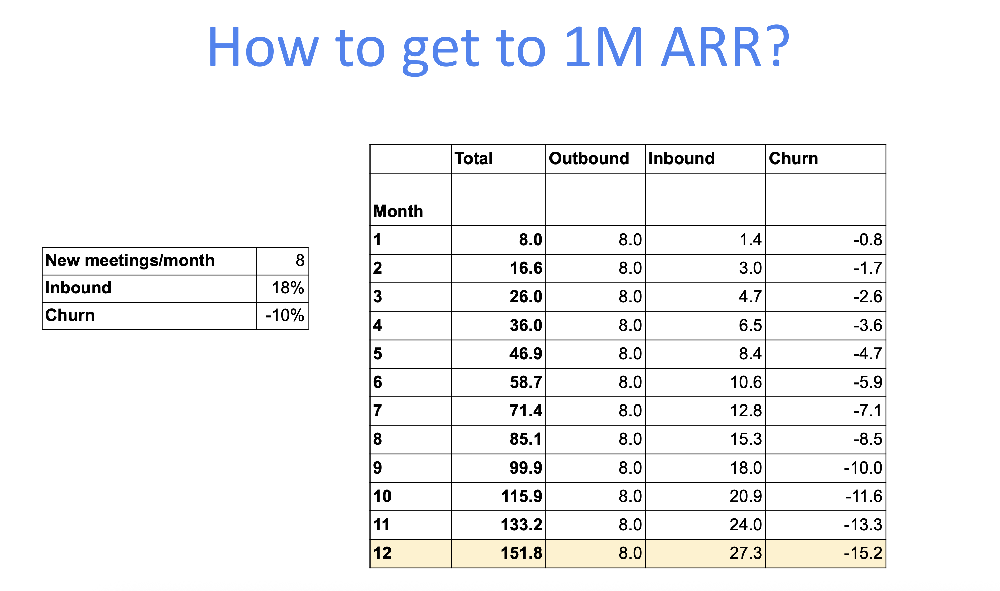
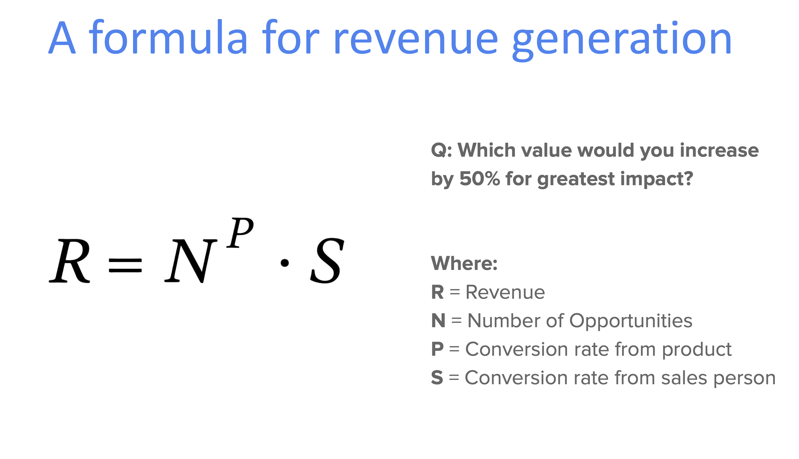

# The Founder's Guide to Closing Your First Million in ARR: A Step-by-Step Sales Playbook

*Breaking down the $1M milestone and why founder-led sales beats traditional approaches every time*

---

**TL;DR:** Getting to $1M ARR isn't about being a sales genius—it's about consistency, customer insights, and doing 10 high-quality outreach messages per day. This comprehensive guide breaks down exactly how technical founders can master sales without losing their product focus.

---

## The $1M ARR Reality Check: It's Simpler Than You Think

Let me start with some math that might surprise you. One million dollars in Annual Recurring Revenue (ARR) sounds intimidating, but when I break it down for founders:

- **$1M ARR = $83,000 monthly recurring revenue (MRR)**
- At $250/month per customer = **332 customers**
- At $500/month per customer = **166 customers**
- At $5,000/month per customer = **Only 16 customers**


Suddenly, that million-dollar milestone doesn't seem so insurmountable, does it? It's actually not that much when you think about it—and of course we're assuming these are monthly recurring subscribers that never churn, but that's just to give you some context on what that number actually means.

But here's the real kicker: **You can hit this target by sending just 10 high-quality emails per day.**

Let me show you the math:

- 10 emails/day → 1.5 meetings per day
- 7.5 meetings/week → 2 customers per week
- 2 customers/week → 8 customers/month



If you're getting eight customers a month and you're selling a product at $500 a month, you're going to hit your 1 million ARR in 12 months. That's assuming you have this inbound ratio—basically, as your company grows there's some referral rate that kicks in. About 18% of your customers might come from inbound, so eventually about halfway through, your inbound channel will actually become more effective than your outbound.

---

## The Revenue Formula That Changes Everything

Now, I know there's some engineers here in the room, so I wanted to actually express revenue as a formula because I want to emphasize how we should be spending our time with sales.

**Revenue = Number of Opportunities^P × Conversion Rate from Salesperson**

Where **P** = Product-Market Fit (the value your product provides)



Based on this formula, can someone guess which letter is going to be the most important to scale? That's right—**P**.

Here's what I'm saying: the value that the product provides is the most important thing, and I'm going to call that PMF. Obviously, you can scale that by having more meetings with people. If you have the best product in the world but you're not having any meetings, it's going to be zero, right?

Another thing I want to point out is this S—how good you are as a salesperson. A lot of founders are very self-conscious about the fact that they're not as good as the salespeople they know. This actually doesn't matter that much, and in fact, it really doesn't matter at all for founder-led sales because at this stage we don't really care about S. We're going to drop the lowest—if we're thinking about O of N, we're going to drop the constants.

What I want to emphasize here is that really what we're focusing on is P, which is really insights. Insights are what lead to PMF.

---

## Why Founder-Led Sales Beats Traditional Sales Every Time

The difference between founder-led and traditional sales isn't just tactical—it's philosophical:

| Traditional Sales                          | Founder-Led Sales                   |
| ------------------------------------------ | ----------------------------------- |
| **Objective:** Close deals           | **Objective:** Find PMF       |
| **Process:** Scaleable               | **Process:** Not Scalable     |
| **Insights:** Secondary              | **Insights:** Primary         |
| **Meeting Format:** Sales Discussion | **Meeting Format:** Interview |
| **Metrics:** Conversion              | **Metrics:** Consistency      |


**The bottom line:** "YOU DON'T HAVE TO BE GOOD AT SALES... JUST CONSISTENT."

The goal of these early conversations is actually insights and PMF—it's not revenue. In fact, you can get revenue in the wrong direction and it might feel good, but it could take you off course completely if it's the wrong customer. The core goal with these very early founder sales is insights that feed back into the product that allows you to bring the experience closer to what will up the revenue.

---

## The Order of Operations: What to Focus on When


Let me be clear about the sequence here:

**Before PMF:**

- Focus on P → Improving PMF through insights

**After PMF:**

- Focus on N → generating more opportunities

**Finally:**

- Focus on S → improving the sales process

This is when you're kind of hitting your Series A—that's when you want to think about bringing on a sales team, not before that. Because when you bring on a sales team, you lose insights. In fact, salespeople are optimized for generating revenue—they're not going to turn down an opportunity that might not be good.

---

## The 5-Stage Founder Sales Framework


This is basically five steps: you come up with a hypothesis, you then test your hypothesis by meeting with customers, and hopefully you're able to convert pilots to contracts. This is a cycle that repeats. The more cycles you get before you run out of money, the greater chance you have at not dying as a startup—which should be the goal.

Where companies fail is they end up going through one cycle per year. Really, the whole point of this talk is: how can you increase the cycle rate?

### Stage 1: Develop Your Hypothesis

Every successful founder-led sales process starts with a clear hypothesis. If you can't explain the value that your product offers and the problem and the ICP in one sentence, you don't actually know what you're doing.

Your hypothesis should include:

- **Ideal Customer Profile (ICP)**
- **Specific Problem/Pain Point (Y)**
- **Your Unique Solution (Z)**
- **Clear Hypothesis Statement**


You need to solve one thing with your startup. Your entire product should do one thing, and it should do one thing for one specific person. That's as far as you need to go, and ideally you should be testing one of these at a time.

It really doesn't take much to test this. For me, I talk to 10 customers that meet the ICP criteria and I'll know whether or not I'm on the right track or I need to revise my hypothesis. That's all it takes—asking the right questions and staying out of the traps The Mom Test will teach you.

### Stage 2: Build Your Target List


I'm not going to spend too much time on this because a lot of you know how to do this. But one thing I want to mention here is it's not just about getting lists anymore because today GTM has completely changed from a couple years ago. AI has saturated the entire outbound market—everyone's getting spam. So the strategy now shifts to being very high quality with your outreach.

You have to spend time reaching out to people if you want them to respond, and it's not worth your time reaching out to a poor quality list. That's basically why I built Haystack, but this is the general framework anyone should go through: start with a large list and figure out what's the 5% in that list that you're actually going to go after, and you're going to spend a lot more time going after that list.

### Stage 3: Master the Art of Quality Outreach


This is a very opinionated message. There's a lot of different things you can try, but the general principle is psychology—people still read messages, but they're way less likely to respond to them now because of how many they get. So messaging really matters.

Here's one framework I really like from The Mom Test because it's specific to founders and it works really well for founders. I use this all the time:

```
Hey Pete,
I'm trying to make desk & office rental less of a pain for new businesses (vision). We're just starting out and don't have anything to sell, but want to make sure we're building something that actually helps (framing).
I've only ever come at it from the tenant's side and I'm having a hard time understanding how it all works from the landlord's perspective (weakness). You've been renting out desks for a while and could really help me cut through the fog (pedestal).
Do you have time in the next couple weeks to meet up for a chat? (ask)

```

The thing to know is that when you're a founder reaching out to your customer, it's not about your product at all—it's about them. It's about you asking them for their time as a founder so that they can help you out. That's really the ask you're making. If you try to pitch a product, it's like shooting with a blindfold on—you have no idea what you're aiming for yet.


### Stage 4: Nail the Discovery Meeting


Your first meeting is make-or-break. Here's the 30-minute structure that works. My first meetings tend to be only 15 to 20 minutes, so I don't actually go this long, but this is the framework:

**Minutes 2-3: Rapport & Context**
Quick greeting and thanks. "Just so we cover what's useful: I'd love to understand how you're handling X today, share what we're building, and decide if a deeper demo makes sense—does that still work?"

**Minutes 15: Discovery (The Most Important Part)**
Ask open, probing questions. Dig for specifics and quantify impact. Listen more than talk. Take notes.


Some dos and don'ts: never talk about what they will do in the future—only ask them questions about what they've done. Do not talk about the solution at all—just talk about the problem. Those are the two biggest takeaways you should internalize.

**Critical rules:**

- 80% listening, 20% talking
- Always record your meetings
- End by scheduling demo if fit
- Never end neutrally—it's either a great meeting or a bad one


If it's not going well, ask them for referrals. Tell them: "Okay, it sounds like you don't have the problem. Now that you know what I'm doing, do you know anyone who might be experiencing this problem that I can talk to?" If you did a good job establishing rapport and got them talking—which people love—they will share contacts with you.

### Stage 5: From Discovery to Contract


You want to get them to an aha moment. Every demo is about a single moment where the light bulb turns on for them, and you want to try to have that on the demo.


When I do a pilot, I try to get them to pay something, and I'll say whatever I need to get them to pay me something: "Oh, I'll give you your money back if it doesn't work out, whatever." You can ask for a full refund within two weeks. Get them to pay you something though, because you do not want to onboard users at this stage for free unless you're a consumer product.

You can actually get the wrong people using your product that steer you in the wrong direction, and when you finally ask for payment, you realize this entire cohort of users would have never paid. Just because they're using it doesn't mean they're going to pay.


After you onboard a customer, a really good thing I like to do is add them to a dedicated Slack channel. We get so much better responses when we're on Slack—it's crazy. It's way easier to get a response on Slack than email because think about it: an email, they have to compose it, it's stuck with all the other spam. But Slack sticks out right where they're communicating with their team already.

---

## The 10-Per-Day Rule: Your Path to Consistency


If there's a takeaway from this entire presentation, it's **do 10 a day**. And then the second one would be: start manual and then scale it up once you know how it works.

The strategy I've seen work really well for founders right now is do 10 a day—allocate a chunk of your day, like an hour, block it off your calendar, and do 10 per day. That's it. If you just follow that, you'll be in the top 3% of founders.

Honestly, if I was an investor, I would just look at which founders are actually doing this 10 per day. I think it would be a really easy way to increase the chance of success.

Your first 10 might be complete failures. You might not get any responses because you're sending the wrong messages, you're using the wrong channels. But if you just keep doing this, you will figure it out.

You should be generating one to two responses from the 10 messages that you send out.

---

## Common Founder Sales Mistakes (And How to Avoid Them)


This is what I see here, not in any particular order:

### 1. Not selling (at all)

Obviously, you can't move forward if you don't sell. Founders love to not sell, especially technical founders.

### 2. Scaling sales too early

For reasons I just mentioned, there's a lot of issues with that.

### 3. Misinterpreting the insights

There's an entire book called The Mom Test which walks you through how you should interpret what people are saying. A really common issue is someone validates you by saying "that's cool" and you go off and build that feature for six months, and you end up building the wrong thing that they ended up not paying for.

### 4. Concluding that a channel "doesn't work" after trying once

I've seen founders try cold email once and say it doesn't work, and they just give up. The problem with that is if you're wrong on that assumption, then your competitors will win because they figured out a way to make it work. So you should treat all these channels more like experiments rather than "it didn't work, therefore I can't do it."

### 5. Wasting time on enterprise customers

Let's say you're in discussions with a company for four months because you have to go through legal, you have to get SOC 2 compliance, you have to implement features that only they asked for. But at the end of it is a huge revenue contract. As a startup, do you think you should spend that four months on that contract versus on smaller contracts but larger quantity?

You're betting your entire company on one single low-probability deal. My very first company—it was a $500,000 to a million-dollar contract with Valve. We realized no one else wanted to buy the product, and we spent a year just on that one customer. Definitely not a good strategy.

---

## Why Founders Must Sell


I think this stuff is pretty clear:

- **Owners of problem + product = deepest expertise**
- **Credibility: prospects love talking to the CEO**
- **Pre-PMF sales ↔ fast feedback loop to iterate**
- **You can't outsource until you know what "good" looks like**
- **Technical founders can learn sales – it's a process**

As a founder, people want to talk to you, but no one wants to talk to the salesperson—especially if no one knows your product or what it is. Also, how do you know a salesperson is doing well or not well if you don't have a benchmark to measure them against?

---

## Tools That Actually Matter


I would say you can use this at the beginning, and once you start to think about scaling, you can incorporate more of these tools. But again, Sales Navigator and Dux Soup—I think someone mentioned they use Dux Soup—it is a great place to start. Most everyone is on LinkedIn, and Sales Navigator searches can get you your starting point list.


This is how I track stuff. As you can see, the rule of the game here—the reason why I put this slide right next to the tools—is just keep it simple. If you're spending a ton of time trying to set up your CRM and make it perfect, you're scared of doing sales, which is fine, but just keep that in mind. It's about the outreach—that's what matters.

Don't get bogged down in these tools. Really, just spend the time sending the manual messages.

---

## The Future of Go-to-Market


**AI SDRs?** First fundamentals, then scale. Who here has heard of AI SDRs? A lot of the stack behind the AI SDR stuff is they're just going out and doing the whole ICP creation, let's pull a massive list of potential targets, let's create some sequencing and run our templates, and then let's blast it off.

I guess there is some appeal in the sense that it could be valuable later stage once you found those sequences and campaigns that already get you to 10 to 15%, but it also disconnects you from the learning and the iteration loops that you get from sending 10 a day.

**Social listening, brand monitoring:** Creates evangelists, meets your customers where they are during the discovery phase.

**Where are we headed?** Verticalized GTM.

There are areas where AI tools are adding a lot of value, and the areas right now are in building high-quality lists and segmenting your leads. If you run a really good, high-quality campaign, you can use the same message template for every person, and each person thinks it's super personalized to them when it's not—you just segmented really well.

The other area where AI is starting to help—and this is more recent—is in the follow-up after the first meeting. After a call, I will put my meeting transcription into ChatGPT, give it a template, and it will customize that template. It will connect my product to exactly what they cared about and write that value proposition. It'll summarize the meeting into three bullet points for me. It has substantially increased the performance of my response emails, and I send them right away because I don't have to take all this time to write a high-quality email.

**My final thoughts:** Founders who sell win; you can learn this. Do unscalable things to land first customers. Personalized outbound beats mass blasts. Meet your customers where they are. Track funnel metrics to drive daily activity. Delight early customers; they become your refs.

---

*Look, the path to $1M ARR isn't about perfecting your sales pitch. It's about having enough quality conversations to discover what people desperately need, then building exactly that. Start tomorrow. Send 10 messages. Have real conversations. Your future million-dollar business is waiting on the other side of those interactions.*
